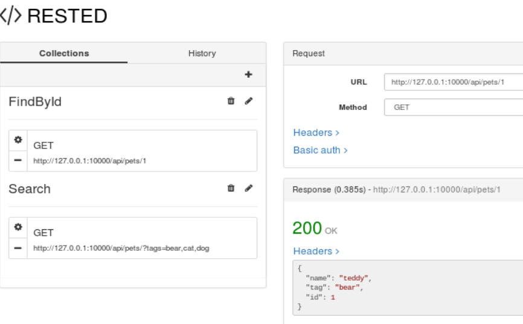

The petstore project
===
The aim of this project is to show how easy is create a microservice from a swagger definition with go-swagger project.

Install go-swagger
---
Download go-swagger from
https://github.com/go-swagger/go-swagger

Follow the instructions about "Docker image" for the Binary distribution.

Folder structure
---
```
$ mkdir ~/go
$ mkdir ~/go/src
$ mkdir ~/go/src/petstore
```

Server source code generation
---
To generate the server source code we  just need a swagger file (json format) and run following sentence.
```
$ cd ~/go
$ swagger generate server --target ~/go/src/petstore --name petstore-app --spec ../petstore-expanded.json
```

Downloading dependencies
---
Obviously our source code have some dependencies to other projects, so we need download those also.
```
$ go get github.com/go-openapi/runtime
$ go get github.com/tylerb/graceful
$ go get github.com/jessevdk/go-flags
$ go get github.com/go-openapi/errors
$ go get github.com/go-openapi/strfmt
$ go get github.com/go-openapi/swag
$ go get golang.org/x/net/context
$ go get github.com/go-openapi/validate
```

Implementing a basic behaviour
---
Lets implement a mock functionality into the source code generated. For this case we have to edit the "configure_petstore_app.go" and modify the following code.
```go
api.AddPetHandler = operations.AddPetHandlerFunc(func(params operations.AddPetParams) middleware.Responder {
  return middleware.NotImplemented("operation .AddPet has not yet been implemented")
})
api.DeletePetHandler = operations.DeletePetHandlerFunc(func(params operations.DeletePetParams) middleware.Responder {
  return middleware.NotImplemented("operation .DeletePet has not yet been implemented")
})
api.FindPetByIDHandler = operations.FindPetByIDHandlerFunc(func(params operations.FindPetByIDParams) middleware.Responder {
  return middleware.NotImplemented("operation .FindPetByID has not yet been implemented")
})
api.FindPetsHandler = operations.FindPetsHandlerFunc(func(params operations.FindPetsParams) middleware.Responder {
  return middleware.NotImplemented("operation .FindPets has not yet been implemented")
})
```

Building the server
---
```
$ go clean -i petstore/models/
$ go clean -i petstore/restapi/operations/
$ go clean -i petstore/restapi/
$ go clean -i petstore/cmd/petstore-app-server/

$ go install petstore/models/
$ go install petstore/restapi/operations/
$ go install petstore/restapi/
$ go install petstore/cmd/petstore-app-server/
```

Starting the server
---
```
$ export PORT=10000
$ ./bin/petstore-app-server
```

URLs to query
---
http://127.0.0.1:10000/api/pets


